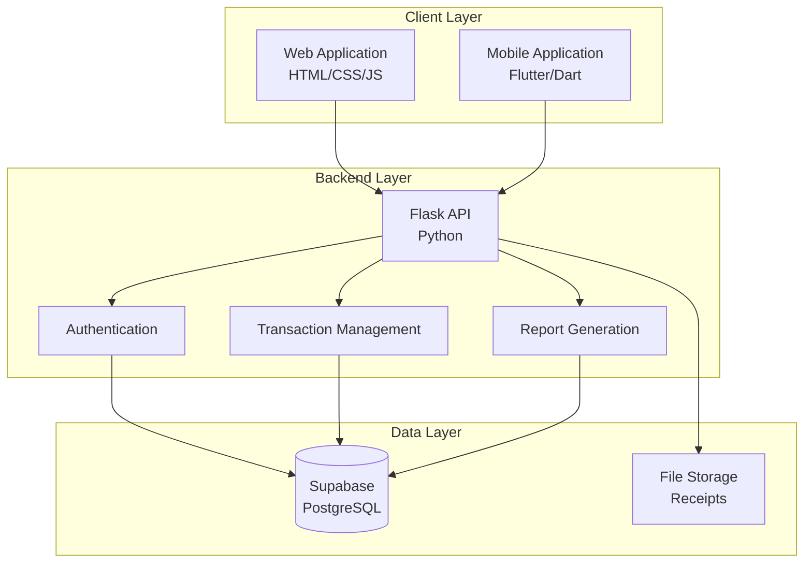

# 💰 PockiTrack (Pocket Tracker)

**A Web and Mobile Application for Managing Petty Cash Transactions of LSPU -- Sta. Cruz Campus Organizations**

<div align="center">


</div>

---

## 📋 Table of Contents
- [About the Project](#about-the-project)
- [Key Features](#key-features)
- [Technologies Used](#technologies-used)
- [System Architecture](#system-architecture)
- [Getting Started](#getting-started)
- [Contributors](#contributors)
- [License](#license)

---

## 📖 About the Project

**PockiTrack** is a comprehensive financial management system designed specifically for student organizations at Laguna State Polytechnic University - Sta. Cruz Campus (LSPU-SCC). The application addresses the challenges of manual petty cash tracking by providing a digital, automated, and transparent solution for recording income and expenses, monitoring event-based transactions, and generating accurate financial reports.

### 🎯 Project Objectives

- **Enhance Transparency**: Real-time recording and monitoring of all financial transactions
- **Reduce Human Error**: Automated balance computation and report generation
- **Promote Accountability**: Organized and accessible records for audit purposes
- **Simplify Workflows**: User-friendly interface for treasurers and OSAS personnel
- **Event-Based Tracking**: Monitor petty cash flow across multiple organizational events

### 🎓 Research Context

This project is developed as a research initiative by students from the College of Computer Studies at LSPU-SCC. It aims to bridge the technological gap in financial management practices of student organizations by replacing traditional paper-based processes with a modern, efficient digital solution.

**For**: Office of Student Affairs and Services (OSAS) and Student Organizations  
**Purpose**: Partial Fulfillment of Academic Requirements  
**Year**: 2025

---

## ✨ Key Features

<table>
<tr>
<td width="50%" valign="top">

### 💼 For Organization Treasurers
- ✅ **Event-Based Transaction Recording**  
  Log income and expenses per organizational event
- 💵 **Automatic Balance Computation**  
  Real-time calculation of petty cash balances
- 📂 **Transaction Categorization**  
  Organize expenses by type and purpose
- 🧾 **Receipt Management**  
  Upload and attach receipt images to transactions
- 📊 **Financial Dashboard**  
  Visual summaries of income, expenses, and balances

</td>
<td width="50%" valign="top">

### 👥 For OSAS Personnel
- 🏛️ **Multi-Organization Oversight**  
  Monitor financial activities across all campus organizations
- ✓ **Report Validation**  
  Review and approve submitted financial reports
- 🔍 **Audit Trail**  
  Complete transaction history for verification purposes
- ⚡ **Real-Time Monitoring**  
  Track organization compliance and reporting status

</td>
</tr>
</table>

### 📊 Additional Capabilities
- **Standardized Financial Reports**: Generate reports compliant with OSAS requirements
- **Event Summaries**: Detailed breakdown of income and expenses per event
- **Exportable Formats**: Print or download reports in various formats
- **Historical Data**: Access past financial records for comparison and analysis
- **Role-Based Access Control**: Separate permissions for treasurers, advisers, and OSAS
- **Secure Authentication**: Protected login system with session management

---

## 🛠 Technologies Used

<div align="center">

### **Frontend Development**


### **Backend Development**


### **Mobile Development**


### **Database & Storage**


### **Development Tools**


</div>

---

### **Technology Stack Details**

<details>
<summary><b>📱 Frontend Technologies</b></summary>

| Technology | Purpose | Role |
|------------|---------|------|
| **HTML5** | Structure and content markup | Web page structure |
| **CSS3** | Styling and responsive design | Visual presentation |
| **JavaScript** | Interactive functionality | Client-side logic |
| **Flutter** | Cross-platform mobile framework | Mobile application |
| **Dart** | Flutter programming language | Mobile app logic |

</details>

<details>
<summary><b>⚙️ Backend Technologies</b></summary>

| Technology | Purpose | Role |
|------------|---------|------|
| **Python** | Core backend programming | Server-side logic |
| **Flask** | Web framework | API and routing |
| **C++** | Performance-critical modules | Computation optimization |
| **REST API** | Client-server communication | Data exchange |

</details>

<details>
<summary><b>💾 Database & Storage</b></summary>

| Technology | Purpose | Role |
|------------|---------|------|
| **Supabase** | Backend-as-a-Service | Database hosting |
| **PostgreSQL** | Relational database | Data storage |
| **Supabase Storage** | File storage | Receipt images |
| **Supabase Auth** | Authentication service | User management |

</details>

---

## 🏗 System Architecture

<div align="center">



</div>

### **Architecture Overview**

PockiTrack follows a **three-tier client-server architecture**:

1. **Presentation Layer** (Client)
   - Web application for desktop access
   - Mobile application for on-the-go management
   
2. **Application Layer** (Backend)
   - RESTful API built with Flask
   - Business logic and data processing
   - Authentication and authorization
   
3. **Data Layer** (Database)
   - PostgreSQL database via Supabase
   - Structured storage for transactions, events, and reports
   - File storage for receipt images

---

## 🚀 Getting Started

### Prerequisites

```bash
# Required installations
✓ Python 3.8+
✓ Node.js and npm
✓ Flutter SDK
✓ Git
✓ Supabase account
```

### Installation

#### **1️⃣ Clone the Repository**

```bash
git clone https://github.com/Snowden199x/PockiTrack.git
cd PockiTrack
```

#### **2️⃣ Backend Setup (Flask)**

```bash
# Navigate to backend directory
cd backend

# Create virtual environment
python -m venv venv

# Activate virtual environment
# Windows:
venv\Scripts\activate
# macOS/Linux:
source venv/bin/activate

# Install dependencies
pip install -r requirements.txt

# Set up environment variables
# Create .env file with:
# SUPABASE_URL=your_supabase_url
# SUPABASE_KEY=your_supabase_key
# SECRET_KEY=your_secret_key

# Run Flask application
python app.py
```

#### **3️⃣ Web Frontend Setup**

```bash
# Navigate to web directory
cd web_development

# Open in browser or use local server
python -m http.server 8000
# Access at http://localhost:8000
```

#### **4️⃣ Mobile Application Setup**

```bash
# Navigate to mobile directory
cd mobile_application

# Get Flutter dependencies
flutter pub get

# Run on connected device/emulator
flutter run
```

---

## 👥 Contributors

<div align="center">

### **Development Team**

<table>
  <tr>
    <td align="center" width="33%">
      <a href="https://github.com/Snowden199x">
        
        <br />
        <sub><b>Patrick John M. Goco</b></sub>
      </a>
      <br />
      <br />
      
      <br />
      
      
      <br />
      <sub>🔧 API Development | Database Design</sub>
    </td>
    <td align="center" width="33%">
      <a href="https://github.com/diannaramilo">
        
        <br />
        <sub><b>Dianna Rose M. Ramilo</b></sub>
      </a>
      <br />
      <br />
      
      <br />
      
      
      
      <br />
      <sub>🎨 Web Design | Frontend Development</sub>
    </td>
    <td align="center" width="33%">
      <a href="https://github.com/Zamuelle-Lorenzo-IT2D">
        
        <br />
        <sub><b>Zamuelle Timothy H. Lorenzo</b></sub>
      </a>
      <br />
      <br />
      
      <br />
      
      
      <br />
      <sub>📱 Mobile UI/UX | Flutter Development</sub>
    </td>
  </tr>
</table>

</div>

---

### **Roles and Responsibilities**

<details>
<summary><b>🔧 Patrick John M. Goco - Backend & Web Developer</b></summary>
<br>

- Backend architecture and API development (Flask, Python)
- Database design and management (Supabase/PostgreSQL)
- Server-side logic and authentication
- RESTful API endpoints and routing
- Data validation and security implementation
- Integration between frontend and backend systems

**Tech Stack**: Python, Flask, PostgreSQL, Supabase, REST API, C++

</details>

<details>
<summary><b>🎨 Dianna Rose M. Ramilo - UI/UX Designer & Frontend Developer</b></summary>
<br>

- User interface design and prototyping
- Web frontend development (HTML, CSS, JavaScript)
- Responsive design implementation
- User experience optimization
- Visual design and branding
- Web application testing and refinement

**Tech Stack**: HTML5, CSS3, JavaScript, Figma/Adobe XD

</details>

<details>
<summary><b>📱 Zamuelle Timothy H. Lorenzo - UI/UX Designer & Mobile Developer</b></summary>
<br>

- Mobile UI/UX design and prototyping
- Flutter application development (Dart)
- Cross-platform mobile implementation
- Mobile-specific feature integration
- User testing and feedback implementation
- Mobile app optimization and deployment

**Tech Stack**: Flutter, Dart, Mobile UI/UX Design

</details>

---

## 🎓 Academic Information

<div align="center">

**Institution**: Laguna State Polytechnic University - Sta. Cruz Campus  
**College**: College of Computer Studies  
**Course**: Bachelor of Science in Information Technology  
**Project Type**: Capstone Research Project  
**Academic Year**: 2024-2025

</div>

---

## 📊 Development Methodology

<div align="center">

```
┌─────────────┐     ┌─────────────┐     ┌─────────────┐
│  Planning   │ ──> │   Design    │ ──> │Development  │
└─────────────┘     └─────────────┘     └─────────────┘
                                              │
┌─────────────┐     ┌─────────────┐          │
│ Deployment  │ <── │   Testing   │ <────────┘
└─────────────┘     └─────────────┘
```

</div>

The project follows an **Iterative Development Model**:

1. **📋 Planning**: Requirements gathering, user interviews
2. **🎨 Design**: UI/UX prototypes, database schema, architecture
3. **💻 Development**: Feature implementation in sprints
4. **🧪 Testing**: Functional, usability, and security testing
5. **🚀 Deployment**: System release and documentation

---

## 🔍 Testing & Quality Assurance

### Evaluation Criteria (ISO 25010)

<div align="center">

| Criterion | Description |
|-----------|-------------|
| ✅ **Content** | Accuracy and completeness of information |
| 🎨 **Design** | Visual appeal and professional appearance |
| ⚙️ **Functionality** | All features work as intended |
| 👤 **Usability** | Easy to learn and use |
| 🧭 **Navigation** | Intuitive flow and structure |
| 🛡️ **Error Handling** | Graceful error management |
| 🔒 **Security** | Data protection and authentication |

</div>

---

## 📝 License

This project is developed for academic purposes as part of the requirements for the Bachelor of Science in Information Technology program at LSPU-SCC.

**© 2025 PockiTrack Development Team. All rights reserved.**

---

## 📞 Contact & Support

<div align="center">

[](https://github.com/Snowden199x/PockiTrack/issues)

**For inquiries**: Contact LSPU-SCC College of Computer Studies  
**Report Issues**: [GitHub Issues Page](https://github.com/Snowden199x/PockiTrack/issues)

</div>

---

## 🙏 Acknowledgments

Special thanks to:
- **LSPU-SCC Administration** for supporting this research initiative
- **Office of Student Affairs and Services (OSAS)** for guidance and feedback
- **Student Organizations** for participation in user testing
- **College of Computer Studies Faculty** for academic supervision
- **Research Advisers** for mentorship and technical guidance

---

## 🌟 Project Status & Roadmap

<div align="center">


</div>

### Development Timeline

- [x] ✅ Requirements gathering and analysis
- [x] ✅ System design and architecture
- [x] ✅ Database schema implementation
- [x] ✅ Backend API development
- [x] ✅ Web frontend development
- [x] ✅ Mobile application development
- [ ] ⏳ User acceptance testing
- [ ] ⏳ System deployment
- [ ] ⏳ Documentation finalization

---

<div align="center">

### 💙 Built for LSPU-SCC Student Organizations

**PockiTrack** - *Smart, Simple, Secure Petty Cash Management*

---


</div>

---

## 📚 Additional Resources

- 📖 [Project Documentation](docs/)
- 🔌 [API Documentation](docs/api.md)
- 📘 [User Manual](docs/user-manual.md)
- 💻 [Developer Guide](docs/developer-guide.md)
- 🗃️ [Database Schema](docs/database-schema.md)

---

<div align="center">

**⭐ Star this repository if you find it helpful!**

</div>
